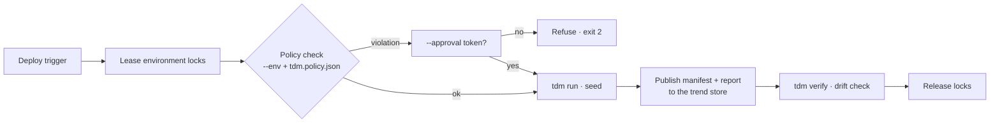

# CD & environments

**Persona:** platform / DevEx. Seeding a laptop is easy; seeding *where other people's
data lives* needs guardrails. This page covers the environment model, shared-environment
coordination, secrets, and post-deploy verification — everything that turns `tdm run`
into a safe deployment step.



## The environment model

`--env <name>` switches on enforcement of a `tdm.policy.json` for that environment,
evaluated **before any persistence**. A worked policy (this file is executed by the
docs-verify job against the sample workspace):

```json
--8<-- "cd-environments/tdm.policy.demo.json"
```

The rules per environment (full schema:
[policy-and-key-registry.md](https://github.com/chrisw000/test-data-manager/blob/main/docs/policy-and-key-registry.md)):

| Rule | Effect |
|---|---|
| `allowedLifecycles` | Reject `Persistent` against prod-like, for instance |
| `requireFailurePolicyAtLeast` | Force `FailRun` where partial seeds are dangerous |
| `maxBulkRowsPerStep` / `maxCreatedRowsPerRun` | Volume caps |
| `connectionStringSources` | e.g. prod-like connection strings must come from `env`, never inline |
| `bannedEntities` / `requiredTags` | Hygiene (e.g. `@seed:` mandatory) |
| `override` | Names the env var whose token `--approval` must match |

Validate against an environment in CI or before deploying:

```bash
--8<-- "cd-environments/01-policy-validate.sh"
```

### Approvals leave a trail

When a rule must be broken deliberately, `tdm run --env prod-like --approval "$TOKEN"`
proceeds *if* the token matches the environment's configured secret — and the manifest
records `policyOverrideApplied: true` alongside the violations it overrode. The exception
is auditable, not silent.

## Shared-environment coordination

Point `registry.url` at a run registry and every `tdm run` leases each domain's target
database before seeding, releasing on completion. Two runs targeting the same database
collide — the second fails fast, naming the holder:

```text
Registry refusal: Database for domain 'Orders' is locked by billing-team nightly-seed
```

- **Leases** are one per `(environment, domain, database)`, enforced by a unique index, so
  a concurrent race resolves to exactly one winner.
- **Heartbeats** renew the lease while the run executes; a crashed run frees the database
  after at most one TTL.
- **`registry.unavailable`** — `Warn` continues without locks, `Fail` refuses (exit 2). A
  *lock conflict* is always fatal regardless — that is the point.

Details: [run-registry-and-locks.md](https://github.com/chrisw000/test-data-manager/blob/main/docs/run-registry-and-locks.md).

## Secrets

TDM stores no secrets and ships no cloud SDKs. Everything resolves through one chain —
inline (dev only) → environment → a host-registered cloud adapter:

- **Connection strings by name** — `connectionStringName: "OrdersDb"` resolves from
  `TDM_CONNECTIONSTRINGS__ORDERSDB` (or a `ConnectionStrings__OrdersDb` fallback), so the
  same settings file works across environments with only the env var changing.
- **Signing-cert password** (`run.signing.certificatePasswordEnv`) and the **registry API
  key** (`registry.apiKeyEnv`) resolve through the same chain.

See [secrets-and-playback.md](https://github.com/chrisw000/test-data-manager/blob/main/docs/secrets-and-playback.md)
and the [configuration reference](../reference/configuration.md#secrets).

## Post-deploy verification & custody

Once seeded, the manifest is the run's flight record — use it:

- **`tdm verify --manifest <file>`** — drift check: every recorded row still exists with
  its recorded values (exit 0 no drift, 1 drift). Run it after deploy, and later to catch
  environment tampering.

```bash
--8<-- "cd-environments/03-verify-drift.sh:cmd"
```

- **`tdm replay --manifest <file>`** — reconstruct exactly the recorded rows (final
  values, not fakers) after a database was reset.
- **Resumable runs** — `tdm run --resume <journal>` skips scenarios/rows a previous run's
  crash-safe journal already proved persisted, so an interrupted deployment continues
  rather than double-seeding.
- **Manifest custody** — a SHA-256 checksum is always written; configure `run.signing`
  for a detached signature. Verify integrity in the pipeline:

```bash
--8<-- "cd-environments/02-manifest-verify.sh"
```

- **Trend store** — `tdm publish --manifest <file> --store <root> --env <name>` files the
  manifest under `{env}/{run}/{timestamp}`, building the history that
  [performance gates](performance-testing.md) and report sparklines read from.

## Where next

- [Performance testing & tracking](performance-testing.md) — baselines, perf gates and
  the trend store the publish step feeds.
- [CI — validate, report, gate](ci.md) — the PR-side gate that precedes all of this.
- [Configuration reference](../reference/configuration.md) — every `registry`, `secrets`
  and `signing` setting.

**Guided tour:** next stop → [Performance testing & tracking](performance-testing.md)
