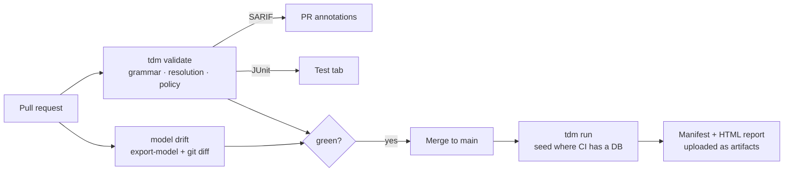

# CI — validate, report, gate

**Persona:** platform / DevEx. This is the golden path a platform team stamps out for
everyone: a data-free gate on every PR, structured output where CI already looks, and a
composite action so teams wire it in three lines. This repository *is* the reference
implementation — its own [`ci.yml`](https://github.com/chrisw000/test-data-manager/blob/main/.github/workflows/ci.yml)
does exactly what this guide describes.

## Three jobs, three things caught



| Job | What it catches | Needs a database? |
|---|---|---|
| **validate** | unmatched steps, unknown/ambiguous entities, unknown properties, policy violations | No |
| **model drift** | the editor's `tdm.model.json` lagging the resolved schema | No |
| **run** | anything only real persistence surfaces (repository/DbContext, constraints) | Yes |

The first two run on every PR with zero infrastructure — that's the whole appeal of
`validate`: it persists nothing.

## The composite action, end to end

The repo ships a composite action at `.github/actions/tdm` (published form:
`chrisw000/test-data-manager/.github/actions/tdm@main`). It maps TDM's exit codes to
pass/warn/fail, emits reports, and uploads the manifest:

```yaml
- name: TDM validate (no database needed)
  uses: chrisw000/test-data-manager/.github/actions/tdm@main
  with:
    command: validate            # validate | run | teardown
    settings: tdm.settings.json
    report-sarif: output/tdm-validate.sarif
    report-junit: output/tdm-validate.junit.xml
```

- **Exit codes** — `0` succeeded, `1` completed-with-warnings (surfaced as a
  `::warning::`), `2+` failed (fails the step). Pipelines need no output parsing.
- **SARIF → PR annotations** — feed `report-sarif` to `github/codeql-action/upload-sarif`
  and unmatched steps / resolution failures annotate the exact feature-file line in the
  diff.
- **JUnit → test tab** — `report-junit` renders scenarios as test results in the CI UI.
- **Manifest + HTML report** — uploaded as build artifacts (`manifest-artifact`,
  `report-html`), so every run leaves a shareable flight record.

Running the same reports locally is one command:

```bash
--8<-- "ci/01-validate-reports.sh"
```

### Model-drift check

The editor model is a committed artifact; fail the PR if it no longer matches the
resolved schema:

```bash
--8<-- "ci/02-model-drift.sh"
```

### Not on GitHub?

The action is a thin wrapper — on Azure DevOps, GitLab, or anything else, run the CLI
directly. The exit-code contract is identical:

```bash
dotnet tool install --global Tdm.Tool
tdm validate --settings tdm.settings.json \
  --report sarif=output/tdm-validate.sarif \
  --report junit=output/tdm-validate.junit.xml
```

## Policy as code in PRs

With `--env` and a `tdm.policy.json`, environment rules and natural-key registry
violations become validation findings — so they annotate the diff before merge, not
after deploy. The rules themselves (allowed lifecycles, bulk caps, connection-source
rules, approvals) are the subject of the [CD & environments guide](cd-environments.md);
in CI you simply add `--env` to the validate step for the target environment.

## Copy-paste starter workflows

**PR gate** — validate + model drift + SARIF annotations, no database:

```yaml
--8<-- "ci/starter-pr-gate.yml"
```

**Nightly seed & verify** — seeds a shared environment, then proves the rows landed:

```yaml
--8<-- "ci/starter-nightly.yml"
```

Both are validated as well-formed workflows by the docs-verify job (every job has
`runs-on` and steps; every step has `uses` or `run`), and they mirror what this repo's
own `ci.yml` does.

## Where next

- [CD & environments](cd-environments.md) — running `run` safely where other people's
  data lives: policy, locks, secrets, verification.
- [Reports & the manifest](../reference/reports-and-manifest.md) — the SARIF/JUnit/HTML
  formats in detail.
- [Editor setup](editor-setup.md) — catch the same issues before the PR.

**Guided tour:** next stop → [CD & environments](cd-environments.md)
